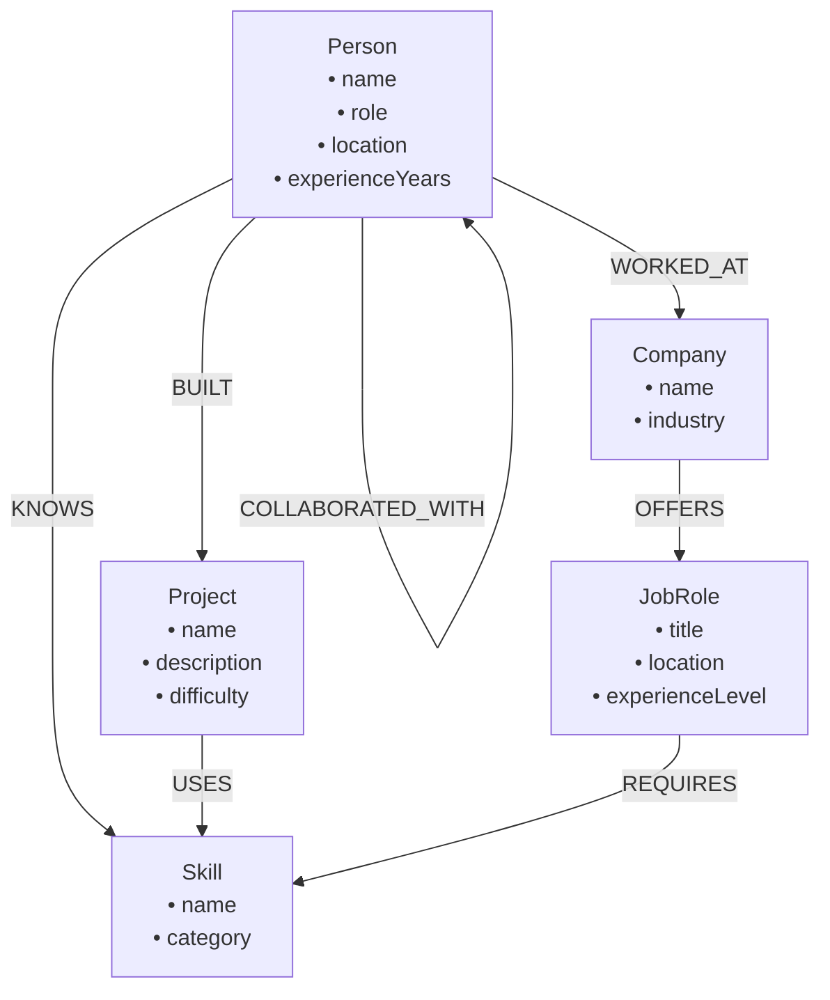
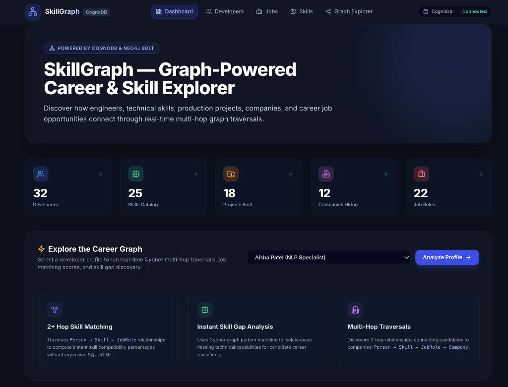
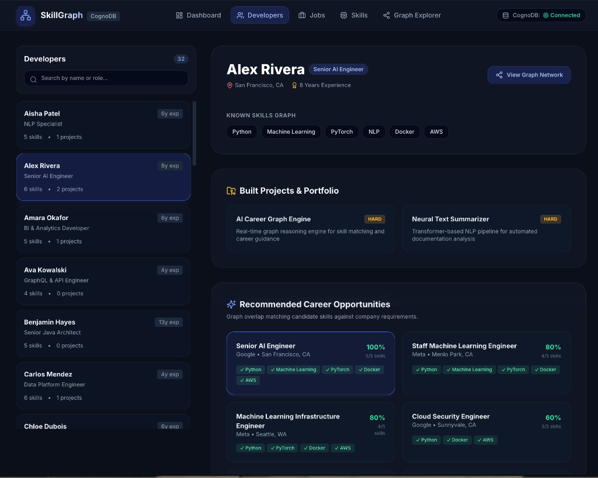
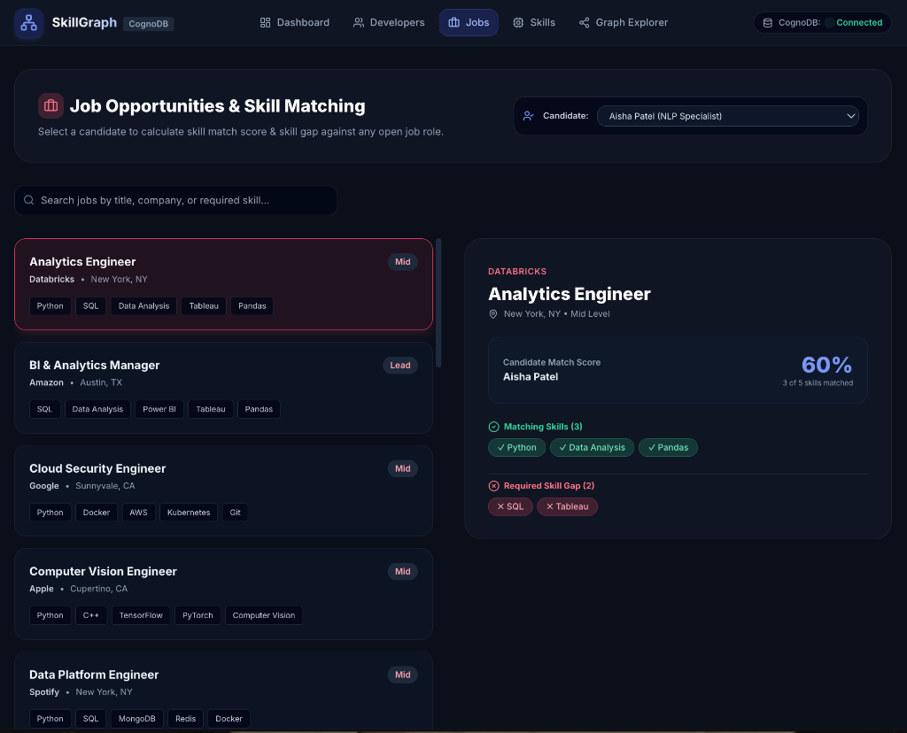
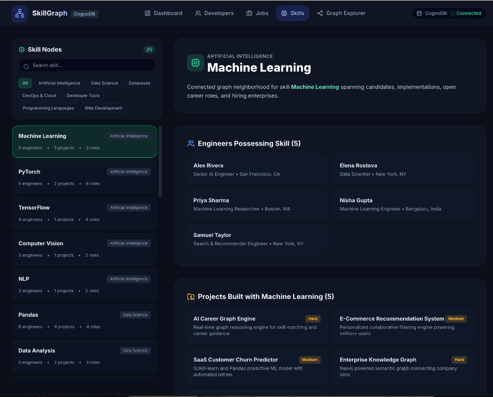
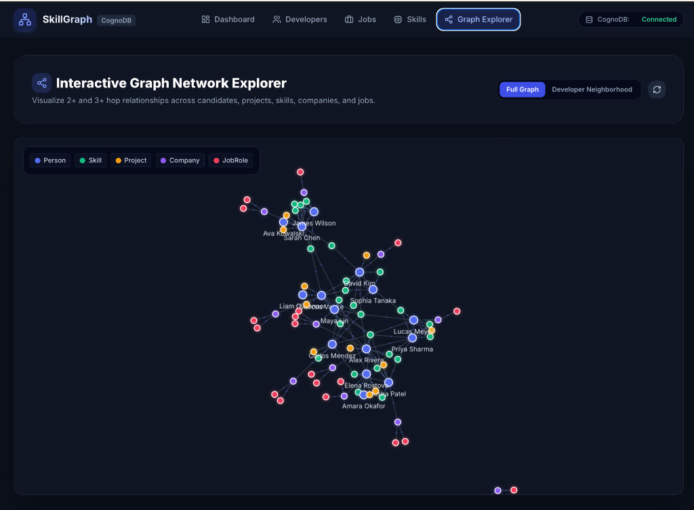
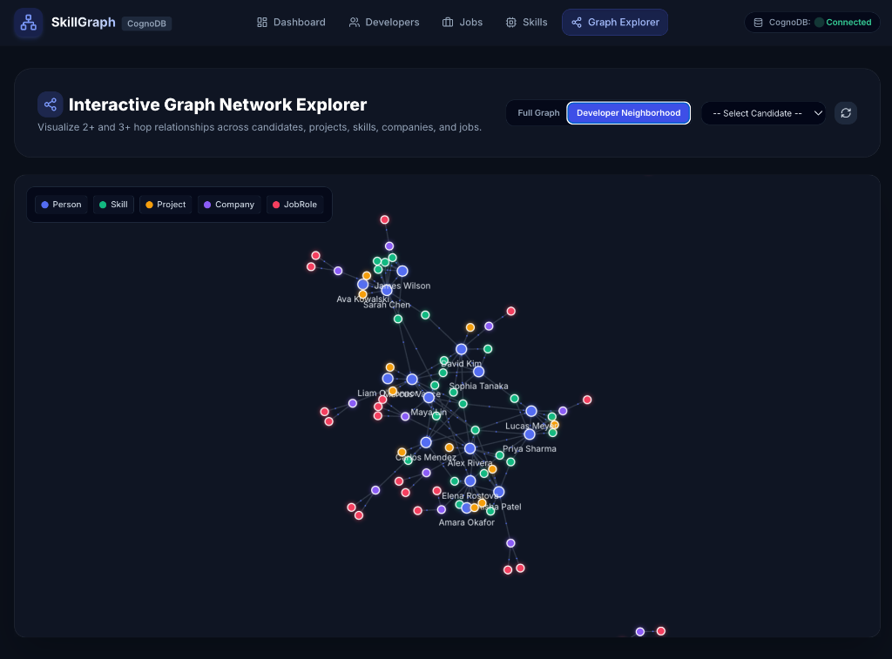
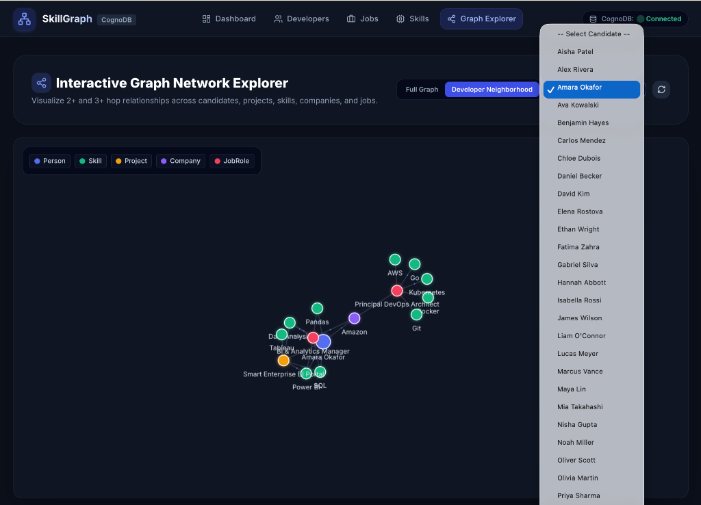

# SkillGraph — Graph-Powered Career & Skill Explorer

SkillGraph is a full-stack technical application built for the **Wexa AI CognoDB take-home assignment**. It is backed by **CognoDB** and uses the official **Neo4j JavaScript driver over Bolt** (`neo4j-driver`). 

The application demonstrates how graph databases naturally model and traverse complex N-to-N network relationships—such as skill dependencies, candidate experience, production project provenance, hiring companies, and job requirements—without the performance overhead and query complexity of multi-table SQL `JOIN`s.

---

## Table of Contents

- [Project Overview](#project-overview)
- [Problem Statement](#problem-statement)
- [Main Features](#main-features)
- [Why CognoDB & Graph Databases?](#why-cognodb--graph-databases)
- [Graph Data Model](#graph-data-model)
  - [Node Types & Properties](#node-types--properties)
  - [Relationships](#relationships)
- [System Architecture](#system-architecture)
- [Complete Data Flow](#complete-data-flow)
- [Important Cypher Queries](#important-cypher-queries)
  - [A. Get a Person's Skills](#a-get-a-persons-skills-1-hop)
  - [B. Get a Person's Projects & Skills](#b-get-a-persons-projects--skills-2-hop)
  - [C. Job Recommendations](#c-job-recommendation-based-on-matching-skills-2-hop)
  - [D. Skill Gap Analysis](#d-skill-gap-analysis-for-a-selected-job)
  - [E. Similar Developers](#e-similar-developers-collaborative-filtering)
  - [F. Multi-Hop Company / Job / Skill Traversal](#f-multi-hop-company--job--skill-traversal-3-hop)
- [Detailed Cypher Explanations](#detailed-cypher-explanations)
  - [Multi-Hop Traversal Explanation](#multi-hop-traversal-explanation)
  - [Job Recommendation Explanation](#job-recommendation-explanation)
  - [Skill Gap Analysis Explanation](#skill-gap-analysis-explanation)
  - [Developer Similarity Explanation](#developer-similarity-explanation)
- [Project Folder Structure](#project-folder-structure)
- [Setup & Installation](#setup--installation)
- [Environment Variables](#environment-variables)
- [Database Seeding](#database-seeding)
- [Running the Application](#running-the-application)
- [Loading, Empty & Error Handling](#loading-empty--error-handling)
- [Security & Parameterized Cypher](#security--parameterized-cypher)
- [Screenshots](#screenshots)
- [Live Demo](#live-demo)
- [Future Improvements](#future-improvements)

---

## Project Overview

SkillGraph provides an interactive visual interface to explore software engineering talent networks, skills, built projects, hiring enterprises, and job roles.

Instead of storing data in rigid relational tables, SkillGraph models career ecosystems as property graphs where candidates (`Person`), technical capabilities (`Skill`), applications (`Project`), enterprises (`Company`), and opportunities (`JobRole`) exist as first-class nodes connected by directed relationships.

---

## Problem Statement

Traditional talent management and job-matching platforms rely on relational databases (RDBMS) or keyword search indices. Relational databases struggle with multi-hop career graph queries because:

1. **Join Explosion**: Finding job recommendations based on overlapping skills requires joining `Person` → `PersonSkill` → `Skill` → `JobRoleSkill` → `JobRole` → `Company`. Each additional hop adds exponential processing overhead.
2. **Rigid Schemas**: Adding new relationship types (e.g. `COLLABORATED_WITH` or `USES`) requires schema alterations and new junction tables.
3. **Awkward Pattern Matching**: Identifying missing skills (anti-patterns) or shared skills (collaborative filtering) produces complex, multi-page SQL subqueries.

SkillGraph solves this by storing relationships natively, allowing openCypher queries to traverse graph paths directly along pointer links.

---

## Main Features

- **Executive Graph Dashboard**: Real-time aggregate statistics displaying node counts (`Person`, `Skill`, `Project`, `Company`, `JobRole`) and relationship counts fetched directly from CognoDB.
- **Developer Profile Explorer**: Interactive candidate lookup showing known skills, portfolio projects, 2-hop job recommendation matches with readiness percentages, and similar developer suggestions.
- **Interactive Skill Gap Analyzer**: Computes candidate skill readiness against target job roles, explicitly categorizing matched vs missing skills required for career transitions.
- **Deep Skill Traversal Catalog**: Examines any technical skill across possessing engineers, implemented projects, requiring job roles, and hiring companies.
- **Interactive Job Explorer**: Browse job roles, company host info, required skills, and run candidate readiness checks.
- **Visual Graph Explorer**: 2D force-directed canvas (`react-force-graph-2d`) rendering color-coded nodes (`Person`, `Skill`, `Project`, `Company`, `JobRole`) with zoom, pan, dragging, and node inspector drawers.
- **Resilient API Architecture**: Express API communicating with CognoDB over Bolt via `neo4j-driver`, featuring centralized error handling and health checks.

---

## Why CognoDB & Graph Databases?

### Relational DB (RDBMS) vs. Graph DB (CognoDB)

| Feature | Relational Database (SQL) | Graph Database (CognoDB / openCypher) |
| :--- | :--- | :--- |
| **Data Storage** | Tables with Rows & Foreign Keys | Nodes with Labels, Properties & Directed Edges |
| **Relationship Lookup** | Intermediate Join / Junction Tables | Native Index-Free Adjacency (direct pointer pointers) |
| **Multi-Hop Traversal** | Slower nested SQL `JOIN`s across 5+ tables | Fast graph path pattern matching |
| **Query Syntax** | Verbose multi-line `SELECT ... JOIN ... WHERE` | Expressive pattern matching (`MATCH (p)-[:KNOWS]->(s)`) |
| **Schema Flexibility** | Rigid table alterations & migrations | Dynamic node labels and property extensions |

Graph databases shine when the **relationships between data points are as important as the data points themselves**. Traverses in CognoDB follow pointer references directly rather than scanning global indices or building expensive Cartesian join matrices.

---

## Graph Data Model



### Node Types & Properties

- **`Person`**: `name` *(Unique)*, `role`, `location`, `experienceYears`
- **`Skill`**: `name` *(Unique)*, `category`
- **`Project`**: `name` *(Unique)*, `description`, `difficulty`
- **`Company`**: `name` *(Unique)*, `industry`
- **`JobRole`**: `title` *(Unique)*, `location`, `experienceLevel`

### Relationships

- `(Person)-[:KNOWS]->(Skill)`
- `(Person)-[:BUILT]->(Project)`
- `(Project)-[:USES]->(Skill)`
- `(Person)-[:WORKED_AT]->(Company)`
- `(Company)-[:OFFERS]->(JobRole)`
- `(JobRole)-[:REQUIRES]->(Skill)`
- `(Person)-[:COLLABORATED_WITH]->(Person)`

---

## System Architecture

```
┌─────────────────────────────────────────────────────────┐
│                      React Frontend                     │
│    (Vite + Tailwind CSS + Lucide Icons + Force Graph)   │
└────────────────────────────┬────────────────────────────┘
                             │
                             │ REST API (JSON over HTTP)
                             ▼
┌─────────────────────────────────────────────────────────┐
│                  Node.js + Express Backend              │
│       Controllers ──► Services ──► Database Module      │
└────────────────────────────┬────────────────────────────┘
                             │
                             │ neo4j-driver over Bolt (bolt+s://)
                             ▼
┌─────────────────────────────────────────────────────────┐
│                   CognoDB Instance                      │
│                (openCypher Graph Engine)                │
└─────────────────────────────────────────────────────────┘
```

---

## Complete Data Flow

1. **User Action**: A user selects a candidate profile or inspects a skill gap in the React UI.
2. **HTTP Request**: Frontend service (`client/src/services/api.js`) issues an Axios request to `/api/jobs/:title/skill-gap/:developerName`.
3. **Express Routing**: Express routes the request to `jobController.getJobSkillGap`.
4. **Service Layer**: Controller delegates business logic to `jobService.getSkillGap`.
5. **Database Driver**: Service executes a parameterized Cypher query using `runQuery()` in `server/config/database.js`.
6. **Bolt Protocol**: The official `neo4j-driver` transmits the parameterized Cypher binary payload over Bolt (`bolt+s://db-1d94f5cc.databases.cognodb.com`) to CognoDB.
7. **Graph Execution**: CognoDB executes graph pattern matching and returns record streams.
8. **JSON Serialization**: Service transforms Neo4j Integer types to native JavaScript primitives and returns a clean JSON object.
9. **UI Render**: React updates state and renders match readiness gauges, skill badges, and graph visualization nodes.

---

## Important Cypher Queries

### A. Get a Person's Skills (1-Hop)
```cypher
MATCH (p:Person {name: $name})-[:KNOWS]->(s:Skill)
RETURN s.name AS skill, s.category AS category
ORDER BY skill;
```

### B. Get a Person's Projects & Skills (2-Hop)
```cypher
MATCH (p:Person {name: $name})-[:BUILT]->(project:Project)-[:USES]->(skill:Skill)
RETURN project.name AS project,
       project.description AS description,
       project.difficulty AS difficulty,
       collect(skill.name) AS skills;
```

### C. Job Recommendation Based on Matching Skills (2-Hop)
```cypher
MATCH (p:Person {name: $name})-[:KNOWS]->(skill:Skill)
WITH p, collect(DISTINCT skill.name) AS personSkills

MATCH (company:Company)-[:OFFERS]->(job:JobRole)-[:REQUIRES]->(reqSkill:Skill)
WITH p, personSkills, company, job, collect(DISTINCT reqSkill.name) AS jobSkills

WITH company, job, jobSkills, personSkills,
     [s IN jobSkills WHERE s IN personSkills] AS matchedSkills,
     [s IN jobSkills WHERE NOT s IN personSkills] AS missingSkills

WHERE size(matchedSkills) > 0
RETURN company.name AS company,
       company.industry AS industry,
       job.title AS title,
       job.location AS location,
       job.experienceLevel AS experienceLevel,
       matchedSkills,
       missingSkills,
       size(matchedSkills) AS matchCount,
       size(jobSkills) AS totalRequired,
       round((toFloat(size(matchedSkills)) / toFloat(size(jobSkills))) * 100) AS matchPercentage
ORDER BY matchCount DESC, matchPercentage DESC;
```

### D. Skill Gap Analysis for a Selected Job
```cypher
MATCH (j:JobRole {title: $title})-[:REQUIRES]->(req:Skill)
WITH j, collect(DISTINCT req.name) AS allRequired

OPTIONAL MATCH (p:Person {name: $developerName})-[:KNOWS]->(devSkill:Skill)
WITH j, allRequired, collect(DISTINCT devSkill.name) AS knownSkills

WITH j, allRequired, knownSkills,
     [s IN allRequired WHERE s IN knownSkills] AS matchedSkills,
     [s IN allRequired WHERE NOT s IN knownSkills] AS missingSkills

RETURN j.title AS title,
       allRequired,
       matchedSkills,
       missingSkills,
       size(matchedSkills) AS matchedCount,
       size(missingSkills) AS missingCount,
       size(allRequired) AS totalCount,
       CASE WHEN size(allRequired) > 0
            THEN round((toFloat(size(matchedSkills)) / toFloat(size(allRequired))) * 100)
            ELSE 0 END AS readinessScore;
```

### E. Similar Developers (Collaborative Filtering)
```cypher
MATCH (p:Person {name: $name})-[:KNOWS]->(skill:Skill)<-[:KNOWS]-(other:Person)
WHERE other <> p
RETURN other.name AS developer,
       other.role AS role,
       other.location AS location,
       other.experienceYears AS experienceYears,
       collect(DISTINCT skill.name) AS sharedSkills,
       count(DISTINCT skill) AS sharedSkillCount
ORDER BY sharedSkillCount DESC
LIMIT 10;
```

### F. Multi-Hop Company / Job / Skill Traversal (3-Hop)
```cypher
MATCH (p:Person {name: $name})-[:KNOWS]->(skill:Skill)<-[:REQUIRES]-(job:JobRole)<-[:OFFERS]-(company:Company)
RETURN company.name AS company,
       company.industry AS industry,
       job.title AS job,
       collect(DISTINCT skill.name) AS matchingSkills
ORDER BY size(matchingSkills) DESC;
```

---

## Detailed Cypher Explanations

### Multi-Hop Traversal Explanation
Multi-hop queries traverse multiple relationship edges in sequence (e.g. `Person → KNOWS → Skill ← REQUIRES ← JobRole ← OFFERS ← Company`). In Cypher, this 3-hop traversal is expressed declaratively in a single line, allowing CognoDB to navigate pointers directly without relational joins across 4 separate bridge tables.

### Job Recommendation Explanation
The recommendation query extracts all skills known by candidate `$name`, matches open `JobRole` nodes that require any of those skills, computes list intersections for `matchedSkills` vs `missingSkills`, and calculates a candidate readiness match percentage (`matchCount / totalRequired * 100`).

### Skill Gap Analysis Explanation
The skill gap query retrieves all required `Skill` nodes for a target `$title`, compares them against candidate `$developerName`'s known skills, and returns an explicit list of `missingSkills`. This pattern matching instantly isolates missing competencies for career upskilling.

### Developer Similarity Explanation
The similarity query performs collaborative filtering by finding other candidate nodes (`other:Person`) connected to the same `Skill` nodes as candidate `$name`. Candidates sharing the highest number of skills are ranked at the top.

---

## Project Folder Structure

```
wexa-skillgraph-assignment/
├── client/                      # React Frontend Application
│   ├── src/
│   │   ├── components/
│   │   │   ├── Common/          # Reusable UI (LoadingState, ErrorState, EmptyState)
│   │   │   ├── Graph/           # Interactive Force Graph Canvas
│   │   │   └── Layout/          # Navigation Header with Live DB Badge
│   │   ├── pages/               # Page Views (Dashboard, DeveloperExplorer, SkillExplorer, JobExplorer, GraphExplorerPage)
│   │   ├── services/            # Axios API Service Layer
│   │   ├── App.jsx              # React Router Entry
│   │   ├── index.css            # Tailwind Directives & Custom Glassmorphism Styles
│   │   └── main.jsx             # React DOM Root
│   ├── index.html               # Entry HTML
│   ├── package.json             # Frontend Dependencies
│   ├── postcss.config.js        # PostCSS Configuration
│   ├── tailwind.config.js       # Tailwind CSS Configuration
│   └── vite.config.js           # Vite Server & API Proxy Setup
│
├── server/                      # Node.js Express Backend
│   ├── config/
│   │   └── database.js          # Official Neo4j Driver Connection Module
│   ├── controllers/             # Express Route Handlers
│   ├── middleware/              # Centralized Error Middleware
│   ├── routes/
│   │   └── api.js               # REST Route Definitions
│   ├── services/                # Business Logic & Parameterized Cypher Queries
│   ├── package.json             # Backend Dependencies
│   └── server.js                # Express App Initialization & Graceful Shutdown
│
├── database/                    # Cypher Artifacts
│   ├── constraints.cypher       # Node Uniqueness Constraints
│   ├── queries.cypher           # Cypher Reference Queries
│   └── seed.cypher              # Cypher Reference Seed Statements
│
├── scripts/
│   └── seed.js                  # Reproducible Node.js Graph Seed Script
│
├── docs/
│   ├── architecture/            # Architectural Diagrams
│   └── screenshots/             # Screenshot Assets
│
├── .env.example                 # Environment Variable Template
├── .gitignore                   # Git Ignore Configuration
├── package.json                 # Root Orchestration Scripts
└── README.md                    # Project Documentation
```

---

## Setup & Installation

### Prerequisites

- **Node.js**: v18.0.0 or higher
- **npm**: v9.0.0 or higher
- Active **CognoDB** instance with Bolt access

### Installation Steps

1. **Clone the Repository**:
   ```bash
   git clone https://github.com/bmaibu/skillgraph.git
   cd wexa-skillgraph-assignment
   ```

2. **Configure Environment Variables**:
   Create a `.env` file in the project root and in `server/` using `.env.example` as a template.

3. **Install Dependencies**:
   ```bash
   # Install root dependencies
   npm install

   # Install server dependencies
   cd server && npm install && cd ..

   # Install client dependencies
   cd client && npm install && cd ..
   ```

---

## Environment Variables

### `.env.example` Schema

```env
# CognoDB Connection Settings
COGNODB_URI=bolt+s://db-1d94f5cc.databases.cognodb.com
COGNODB_USERNAME=cognodb
COGNODB_PASSWORD=your_cognodb_password_here

# Backend Server Configuration
PORT=5001
```

> [!CAUTION]
> Never commit actual credentials to Git. The `.env` file is excluded in `.gitignore`. Credentials are read exclusively by the Node.js backend server and are never exposed to the frontend browser.

---

## Database Seeding

To apply uniqueness constraints and populate the CognoDB database with reproducible seed data, run:

```bash
npm run seed
```

### Seed Data Overview

The seed script (`scripts/seed.js`) executes parameterized `MERGE` queries to populate:
- **32 `Person` Nodes**
- **25 `Skill` Nodes**
- **18 `Project` Nodes**
- **12 `Company` Nodes**
- **22 `JobRole` Nodes**
- **402 Graph Relationships** (`KNOWS`, `BUILT`, `USES`, `WORKED_AT`, `OFFERS`, `REQUIRES`, `COLLABORATED_WITH`)

Running the seed script multiple times is safe because `MERGE` prevents duplicate node or relationship creation.

---

## Running the Application

### 1. Start the Backend Server (Port 5001)

```bash
npm run server
```
*Outputs: `🚀 SkillGraph API Server running on port 5001`*

### 2. Start the Frontend Development Client (Port 3000)

In a separate terminal window:
```bash
npm run client
```
*Outputs: `Local: http://localhost:3000/`*

### 3. Concurrent Execution

Alternatively, start both frontend and backend concurrently from the root directory:
```bash
npm run dev
```

---

## Loading, Empty & Error Handling

- **Loading States**: Skeletons (`CardSkeleton`) and spinners (`Spinner`) display during async Cypher query execution. Blank screens are prevented.
- **Empty States**: Friendly empty state banners (`EmptyState`) display when searches yield no matching nodes or candidates.
- **Error States**: Centralized error middleware catches database connection disconnections or invalid parameters, presenting a user-friendly error card (`ErrorState`) with a **Retry** button.
- **Graceful Fallbacks**: If CognoDB is temporarily unreachable, `/api/health` returns status `503` with database status `unavailable` without crashing the Express process.

---

## Security & Parameterized Cypher

To prevent Cypher injection attacks, **all database queries use parameterization**.

### Correct (Parameterized Query)
```javascript
session.run(
  `
  MATCH (p:Person {name: $name})
  RETURN p
  `,
  { name }
);
```

### Incorrect (String Concatenation — Forbidden)
```javascript
// NEVER DO THIS
session.run(`MATCH (p:Person {name: "${name}"}) RETURN p`);
```

All backend services (`developerService`, `jobService`, `skillService`, `companyService`, `graphService`) enforce parameterized execution.

---

## Screenshots

### 1. Executive Graph Dashboard

*Executive dashboard displaying real-time CognoDB node counts (32 Developers, 25 Skills, 18 Projects, 12 Companies, 22 Job Roles), candidate search selector, and graph traversal value highlights.*

---

### 2. Developer Profile Explorer & Job Recommendations

*Developer profile view displaying candidate skills, built portfolio projects, and 2-hop job recommendations with match percentages (e.g., Alex Rivera matching 100% with Senior AI Engineer at Google).*

---

### 3. Job Opportunities & Skill Gap Analysis

*Job Explorer demonstrating candidate skill readiness scoring and detailed skill gap analysis (e.g., Aisha Patel at 60% match for Databricks Analytics Engineer, highlighting 3 matched skills and 2 missing skills).*

---

### 4. Skill Nodes Explorer

*Skill-centric graph view displaying the connected graph neighborhood for Machine Learning across possessing engineers, implemented projects, and open career roles.*

---

### 5. Interactive Graph Explorer (Full Graph Network)

*Visual 2D force-directed node graph rendering color-coded nodes (`Person`, `Skill`, `Project`, `Company`, `JobRole`) and relationship edges.*

---

### 6. Interactive Graph Explorer (Developer Neighborhood)

*Graph Explorer filtered to a candidate's 2-hop graph neighborhood (`Amara Okafor`).*

---

### 7. Candidate Selector Dropdown

*Candidate dropdown selector in Graph Explorer enabling real-time neighborhood graph visualization.*

---

## Live Demo

- **Frontend Web Application**: [https://skillgraph-frontend-mg6z.onrender.com/](https://skillgraph-frontend-mg6z.onrender.com/)
- **Backend API Service**: [https://skillgraph-2kib.onrender.com](https://skillgraph-2kib.onrender.com)
- **Backend Health Check**: [https://skillgraph-2kib.onrender.com/api/health](https://skillgraph-2kib.onrender.com/api/health)

---

## Future Improvements

- **Interactive Graph Mutations**: Allow adding new skills, projects, and relationships directly from the UI via Cypher `CREATE`/`MERGE` endpoints.
- **Vector Embeddings Integration**: Combine graph traversals with vector similarity search for semantic skill matching.
- **Graph Path Export**: Export multi-hop career traversal paths as downloadable JSON or SVG reports.
